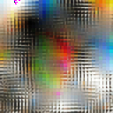

## Introduction

(Note: I'm currently taking a break from this project to work on some self-supervised learning and neuroevolution projects. I'll probably resume later)

This is a repo for audio generation models, in particular VAEs and VQ-VAEs. It is in some sense incomplete at the moment, though running the training script in the networks folder will create an autoencoder for audio generation. Nonetheless, there are still many to-dos and updates, as the generation quality is not ideal currently.

If you are interested in a general implementation of Soundstream or a neural audio codec, you should probably check out lucidrain's [implementation](https://github.com/lucidrains/audiolm-pytorch) or Facebook/Meta's [encodec](https://github.com/facebookresearch/encodec). While I used ideas from neural audio codecs, this repository also contains my experiments with audio generation. These ideas may be interesting:

* I've implemented [multiresolution convolutions](https://arxiv.org/abs/2305.01638), see the networks/wavelets.py file (which also includes an attempt at a wavelet-based upscaler). While they are implemented, these are not currently integrated into the main VQ-VAE model
* I've added [modern self-organizing maps](https://arxiv.org/abs/2302.07950) to the codebooks, see networks/som_utils.py. I also include a test on CIFAR which makes pretty pictures. 

I hope that SOMs will serve to make attention mechanisms on the codebook more robust (since the codebook has a natural notion of neighborhood and proximity among entries)

* I explored the use of energy transformers for this task. This was initially included in this repository, but now is its own [seperate repository](https://github.com/LumenPallidium/energy_transformer), from where it can be pip installed (see instructions there).

## Acknowledgements
The work of Phil Wang [(lucidrains)](https://github.com/lucidrains) was important both as a reference and for some functions. While this repo was mostly developed independently, a number of key steps were drawn from his work, most notably in the structure of "causal" convolution layers. Additionally, reference was made to the [encodec](https://github.com/facebookresearch/encodec) repo from Facebook Research, which were referenced for further improving the causal convolution layers. Additionally, reference
was made to OpenAI's Jukebox model and rosinality's VQ-VAE for building the 
VQ-VAE layers.

## Running This

The main parameters you might want to control are in the config/training.yml file. I prefer using configs to CLI arguments, so argparse etc are not implemented.

See environment.yml for the package details. It's probably better as a guideline. An important thing to mention is that you should use the latest Pytorch versions, as I do use torch.func for the energy transformers (need to take gradients, differentiably).

## The Generative Model

The current state of the model is heavily based on [Soundstream](https://arxiv.org/pdf/2107.03312.pdf), a vector-quantized variational autoencoder (VQ-VAE). This uses a fully convolutional encoder, a residual vector quantization layer, and a fully (transposed) convolutional decoder. If you want to run this model, see the training.py file, which contains everything needed to train it on a dataset.

The advantage of fully convolutional encoders and decoders is that they allow arbitrary input length. Residual vector quantization involves quantizing a signal, subtracting the quantized signal from the original, and iteratively quantizing the residual from that repeating the process. It's advantageous here because it can enable the quantizer to capture a huge permutation of "symbols" without using a similarly huge codebook.

As of this writing, the main differences between this implementation and the original Soundstream paper are:

* Different parameters in general
* A new optional optimizer objective: the channel average of the layer activations for the transpose convolution steps should approximate the signal downsampled to the same size
* Addition of some objectives from encodec, such as using more discriminators and multispectral windows
* The STFT discriminators don't act over complex numbers, they are in a 2-channel real domain (this ran much better on older versions of PyTorch, it's likely no longer neccesary)
* The option to use an energy-transformer as a bottleneck layer. This is a Hopfield inspired model that has some similarity to residual vector quantization - unlike a traditional transformer, the residual of the input is repeatedly run through the network (which fulfills the process of energy minimization). This bottleneck led to a much stronger model than the using RVQ.
* The discriminator has a term adding stronger repulsion between fake and real inputs. I found that the default hinge loss led to discriminator collapse (i.e. the discriminator returned the same value for all inputs, real or fake)
* I added the option to allow using only 1 discriminator at a time - which I found significantly improved speed without harming quality.

## Random Notes

* The convert_to_wav script was useful for converting mp3s to wavs cause Soundfile on windows can't open mp3s as tensors 🫠

